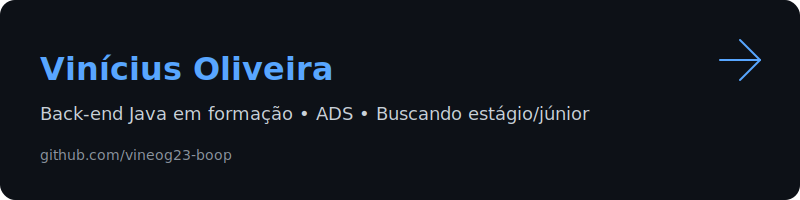

  

<h1 align="center">Olá, eu sou o Vinícius Oliveira! 👋</h1>
<h3 align="center">Estudante de Análise e Desenvolvimento de Sistemas • Foco em Back-end Java</h3>

  
  

---

## 🚀 Sobre Mim

Sou um estudante dedicado de **Análise e Desenvolvimento de Sistemas (ADS)**, com uma paixão crescente pelo universo do **Back-end Java**. Meu objetivo é consolidar uma base sólida em **Programação Orientada a Objetos (POO)** e no desenvolvimento de **APIs robustas**, buscando minha primeira oportunidade como **Estagiário ou Desenvolvedor Júnior**.

Minha jornada é focada em aprender "do jeito certo", aplicando conceitos de:
-   **POO**: Herança, Polimorfismo, Encapsulamento e Interfaces.
-   **Estrutura de Projetos**: Organização de pacotes e separação de responsabilidades.
-   **Boas Práticas**: Código limpo, legível e com documentação clara.

---

## 🛠️ Minha Stack

  
  
  
  

---

## ✨ Projetos em Destaque

  
  

---

## 📊 GitHub Stats

  <picture>
    <source media="(prefers-color-scheme: dark)" srcset="https://github-readme-stats.vercel.app/api?username=vineog23-boop&show_icons=true&theme=tokyonight&hide_border=true&bg_color=00000000">
    <source media="(prefers-color-scheme: light)" srcset="https://github-readme-stats.vercel.app/api?username=vineog23-boop&show_icons=true&theme=default&hide_border=true&bg_color=00000000">
    
  </picture>
  <picture>
    <source media="(prefers-color-scheme: dark)" srcset="https://github-readme-stats.vercel.app/api/top-langs/?username=vineog23-boop&layout=compact&theme=tokyonight&hide_border=true&bg_color=00000000">
    <source media="(prefers-color-scheme: light)" srcset="https://github-readme-stats.vercel.app/api/top-langs/?username=vineog23-boop&layout=compact&theme=default&hide_border=true&bg_color=00000000">
    
  </picture>

  <small><i>💡 Top Languages mostra volume de código, não nível de proficiência.</i></small>

---

  <i>"O sucesso é a soma de pequenos esforços repetidos dia após dia."</i>

