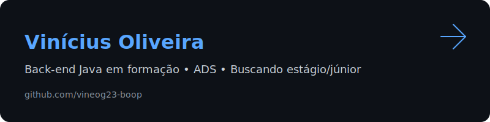

  

<h1 align="center">Vinícius Oliveira</h1>
<h3 align="center">Desenvolvedor Back-End Java em formação</h3>

  ADS • Pós em Arquitetura e Desenvolvimento Java • Foco em Spring Boot, JPA e APIs REST

  
  

---

## Sobre

Estudante de Análise e Desenvolvimento de Sistemas com foco em **Java backend**, **Spring Boot**, **Spring Data JPA**, **SQL** e **arquitetura em camadas**.

Este perfil reúne projetos voltados à construção de **APIs REST**, persistência de dados, documentação técnica e evolução consistente em desenvolvimento back-end com Java.

---

## Stack principal

  
  
  
  
  
  
  
  
  
  
  

---

## Projetos em destaque

### [LocalTech](https://github.com/vineog23-boop/LocalTech)
API REST para locadora de veículos.  
Demonstra organização em camadas, modelagem de domínio e implementação de operações de back-end com Java.

### [gestao-vagas](https://github.com/vineog23-boop/gestao-vagas)
API REST para gestão de candidatos.  
Demonstra validação de entrada, persistência com Spring Data JPA e tratamento centralizado de exceções.

### [CadastroPersonagens](https://github.com/vineog23-boop/CadastroPersonagens)
Projeto de API REST voltado a CRUD e relacionamento entre entidades.  
Demonstra prática com Spring Boot, Flyway, mapeamento entre camadas e organização de código.

### [Portfolio-Java-Estudos](https://github.com/vineog23-boop/Portfolio-Java-Estudos)
Repositório curado de estudos e exercícios em Java.  
Funciona como base prática de fundamentos que sustentam os projetos back-end mais estruturados.

---

## O que este GitHub mostra

- APIs REST com Spring Boot
- Persistência com JPA
- Organização em camadas
- Documentação técnica
- Evolução contínua em Java backend

---

## GitHub Stats

  
  

  <small><i>Top Languages mostra volume de código, não nível de proficiência.</i></small>

