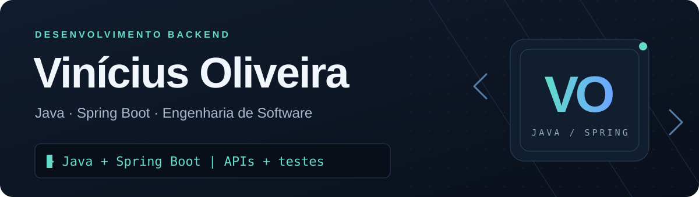

  

  
  
  

  <strong>Em busca da primeira oportunidade em backend Java · Estágio / Júnior</strong> 
  São Carlos, SP

## Sobre mim

Sou o Vinícius, estudante de **Engenharia de Software** e pós-graduando em **Arquitetura e Desenvolvimento Java na FIAP**. Desenvolvo projetos acadêmicos e pessoais com Java e Spring Boot, com foco em APIs, persistência, segurança e testes.

Minha primeira formação foi em **Fisioterapia pela UFSCar**. Hoje, construo minha trajetória em tecnologia e também exploro aplicações na área da saúde, como o **Medflow**.

- **Na prática:** APIs REST, Spring Security com JWT, JPA, validações e testes automatizados.
- **Estudando agora:** microsserviços, comunicação entre serviços e mensageria.
- **Interesses:** backend, arquitetura de software e produtos digitais.

## Stack e ferramentas

  
  
  
  
  
  
  
  

  Java · Spring · MySQL · Hibernate · Maven · Docker · Git · Postman

<strong>Ver tecnologias e práticas por área</strong>

| Área | Tecnologias e práticas |
| :--- | :--- |
| **Backend** | Java · Spring Boot · Spring MVC · APIs REST · Bean Validation |
| **Persistência** | Spring Data JPA · Hibernate · JDBC · SQL · MySQL · H2 · Flyway |
| **Segurança** | Spring Security · JWT · BCrypt |
| **Testes** | JUnit · Mockito · AssertJ · MockMvc |
| **Entrega e documentação** | Git · Maven · Docker Compose · Postman · OpenAPI/Swagger · MapStruct |

## Projetos em destaque

<table>
<tr>
<td>

### 🍽️ [GastroHub](https://github.com/vineog23-boop/gastrohub)

**Projeto em equipe · Tech Challenge FIAP**

Backend para uma plataforma de restaurantes, com gerenciamento de usuários, endereços e autenticação. Reúne autenticação JWT, perfis de acesso, validações, migrations e testes unitários e de integração.

**Java 21 · Spring Boot · Spring Security · MySQL · Flyway · Docker**

[Explorar o projeto →](https://github.com/vineog23-boop/gastrohub)

</td>
</tr>
</table>

<table>
<tr>
<td>

### 🩺 [Medflow](https://github.com/vineog23-boop/Medflow)

**Projeto pessoal · Em desenvolvimento**

API para gerenciamento de pacientes e ordens de exame, com CRUD, paginação, DTOs, validações e erros padronizados. Organizada por funcionalidade, com testes de domínio, serviços e camada HTTP.

**Java 21 · Spring Boot · Spring Data JPA · Bean Validation**

A configuração de infraestrutura e a integração de mensageria estão entre as próximas etapas.

[Explorar o projeto →](https://github.com/vineog23-boop/Medflow)

</td>
</tr>
</table>

<strong>Mais projetos e fundamentos</strong>

| Projeto | O que pratico |
| :--- | :--- |
| [Gestão de Vagas API](https://github.com/vineog23-boop/gestao-vagas) | Cadastro e gerenciamento de candidatos, persistência com JPA, validação e tratamento de exceções. |
| [Lanchonete API](https://github.com/vineog23-boop/lanchonete-api) | Desenvolvimento de API REST com Spring Boot, organização em camadas e persistência. |
| [Locatech API](https://github.com/vineog23-boop/locatech-api) | Locação de veículos, Spring JDBC e H2. |
| [Java Studies Portfolio](https://github.com/vineog23-boop/java-studies-portfolio) | Lógica, orientação a objetos e pequenos projetos em Java. |

  <a href="https://github.com/vineog23-boop?tab=repositories"><strong>Ver todos os repositórios →</strong></a>

## Atividade no GitHub

  

  Contribuições incluem commits, pull requests e outras atividades reconhecidas pelo GitHub.

<strong>Ver contagem de commits e linguagens</strong>

  
  

  A distribuição das linguagens representa código nos repositórios, não proficiência.

## Próximos passos

- Evoluir o **Medflow**, conectando a API à infraestrutura de persistência.
- Aprofundar **Eureka, API Gateway, LoadBalancer e OpenFeign** nos estudos de microsserviços.
- Praticar **mensageria**, segurança de APIs e testes das regras de negócio.

---

  <strong>Vamos conversar sobre Java, projetos e oportunidades?</strong>  
  <a href="https://www.linkedin.com/in/vinícius-oliveira-1770b7306">LinkedIn</a>
  &nbsp; · &nbsp;
  <a href="mailto:vine.og23@gmail.com">vine.og23@gmail.com</a>

<!-- Ícones: tandpfun/skill-icons (MIT), licença em assets/icons/LICENSE. -->
<!-- Estatísticas: stats-organization/github-stats-extended. -->
