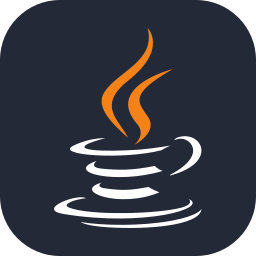
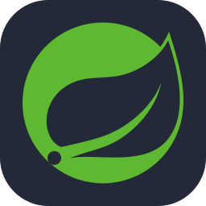
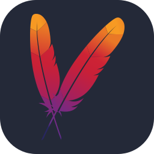

  

  
  
  
    
  

  <strong>Engenheiro de software júnior | Back-end Java</strong> 
  São Carlos/SP · Remoto ou híbrido

## Sobre mim

Sou Vinícius Oliveira. Busco minha primeira oportunidade profissional em desenvolvimento de software e construo APIs e integrações com **Java e Spring Boot** em projetos pessoais, acadêmicos e em equipe. Minha prática inclui persistência, segurança, mensageria com Kafka e testes de integração contra banco e broker reais.

Curso **Engenharia de Software na FIAP** e a pós-graduação em **Arquitetura e Desenvolvimento Java** na mesma instituição. Minha transição da Fisioterapia, concluída na UFSCar, é planejada. Também sou proprietário da Central Lanches, negócio da família em São Carlos, com vivência em operação e atendimento ao cliente.

## Projetos em destaque

### 🩺 [Medflow](https://github.com/vineog23-boop/medflow)

**Projeto pessoal · API clínica**

API de pacientes, catálogo de exames, ordens de exame, laudo clínico e notificações. O problema central não é o CRUD: publicar evento no broker dentro da requisição HTTP cria escrita dupla. A ordem e o evento são gravados na mesma transação PostgreSQL (**Transactional Outbox**), um publicador agendado envia, e cada consumidor deduplica por `(event_id, consumer_group)`. Falha repetida vai para **Dead Letter Topic** com backoff exponencial.

A suíte tem **140 testes**: domínio puro, serviço com Mockito, web com MockMvc, persistência contra PostgreSQL real e um teste ponta a ponta do ciclo completo com Kafka real, incluindo reentrega de eventos (Testcontainers). Erros padronizados em RFC 9457 e schema versionado com Flyway em `ddl-auto=validate`.

🚧 Próximos passos no projeto: Spring Security, documentação OpenAPI e notificações externas.

**Java 21 · Spring Boot 4 · PostgreSQL · Kafka (KRaft) · Flyway · Outbox transacional · RFC 9457 · Testcontainers**

### 🚦 [F.O.G.O.](https://github.com/vineog23-boop/dsin-coder-challenge-fogo)

**Desafio técnico · DSIN Coder Challenge · Aplicação completa**

Inventário de equipamentos IoT de trânsito e central de operações ao vivo de Presidente Prudente/SP. Sobe inteiro com um comando (`docker compose up --build`), já com dados de demonstração gerados por semente fixa.

As características por tipo de equipamento usam herança JPA JOINED em vez de JSONB, para manter `NOT NULL` e `CHECK` reais no banco — a decisão está registrada no README junto com o custo aceito. **244 testes** (183 no back-end, 61 no front-end). O repositório traz a tabela de decisões técnicas e a declaração de uso de IA exigida pelo desafio: fluxo spec-driven, nenhuma linha de código antes de spec aprovada e regras de negócio em TDD.

**Java 21 · Spring Boot 4 · PostgreSQL · JWT · Swagger · React · TypeScript · Leaflet · Testcontainers**

### 🏗️ [Vistor.IA](https://vistoria-app.com)

**Projeto em equipe · 2º lugar no Tech4Change FIAP · Aplicação online, repositório privado**

Vistoria de entrega de chaves com apoio de IA. Implementei back-end e front-end: integração com o Gemini para análise multimodal de fotografias, com validação das respostas e tratamento de falhas da integração; autenticação e autorização; e relatórios PDF com fotos e marcações vinculadas aos achados da análise. Mais de 30 pull requests meus aprovados e integrados no repositório do time.

[Acessar a aplicação →](https://vistoria-app.com)

**Java 21 · Spring Boot 3.2 · Spring Security · JWT · Gemini · Next.js · React · TypeScript**

### 🍽️ [GastroHub](https://github.com/GabouKing/gastrohub)

**Projeto acadêmico · Tech Challenge FIAP · Equipe de 5 pessoas**

Minha contribuição inclui o CRUD de itens de cardápio em Clean Architecture, **38 testes** e a configuração da cobertura mínima de linhas em **80% no JaCoCo**. O [PR #5](https://github.com/GabouKing/gastrohub/pull/5) registra **93,38% de cobertura de linhas**, métrica referente à suíte do projeto. Na Fase 1 do desafio, entreguei a [documentação Swagger, testes unitários e README](https://github.com/Joaomacosdev/gastrohub/pull/15), aprovados em revisão.

**Java · Spring Boot · Clean Architecture · JUnit · Mockito · JaCoCo**

### ☁️ [Tech Challenge Cloud](https://github.com/RafaelSoaresA/Tech-Challenge-4---Cloud)

**Projeto acadêmico · Equipe · Serverless na AWS**

Participei das histórias de [segurança, monitoramento e qualidade](https://github.com/RafaelSoaresA/Tech-Challenge-4---Cloud/pull/8) de uma aplicação serverless com Lambdas em Java e Quarkus, infraestrutura descrita em AWS SAM e deploy por GitHub Actions.

**Java 21 · Quarkus · AWS Lambda · AWS SAM · DynamoDB · SNS · EventBridge · S3 · GitHub Actions**

<strong>Mais projetos e fundamentos</strong>

| Projeto | O que pratico |
| :--- | :--- |
| [Vistoria Predial](https://github.com/vineog23-boop/vistoria-predial) | Primeira versão do projeto de vistoria, que implementei sozinho: JWT por perfil, autorização por recurso, upload validado por assinatura e testes com PostgreSQL real. |
| [TechNews](https://github.com/vineog23-boop/technews) | Clone do TabNews como projeto de estudo do curso.dev; primeiros passos com Node e JavaScript. |
| [Gestão de Vagas API](https://github.com/vineog23-boop/gestao-vagas) | Cadastro, listagem e atualização do nome de candidatos; primeiros passos com Spring Data JPA e H2. |
| [Locatech API](https://github.com/vineog23-boop/locatech-api) | Modelagem inicial de locação de veículos e estudos de JDBC; CRUD ainda em desenvolvimento. |
| [Java Studies Portfolio](https://github.com/vineog23-boop/java-studies-portfolio) | Lógica, orientação a objetos e pequenos projetos em Java. |

  <a href="https://github.com/vineog23-boop?tab=repositories"><strong>Ver todos os repositórios →</strong></a>

## Stack e ferramentas

  
  
  
  
  
  
  
  

  Java · Spring · MySQL · Hibernate · Maven · Docker · Git · Postman

<strong>Ver tecnologias e práticas por área</strong>

| Área | Tecnologias e práticas |
| :--- | :--- |
| **Backend** | Java · Spring Boot · Spring MVC · APIs REST · Bean Validation |
| **Persistência** | Spring Data JPA · Hibernate · JDBC · SQL · PostgreSQL · MySQL · H2 · Flyway |
| **Segurança** | Spring Security · JWT · BCrypt |
| **Mensageria** | Kafka · Spring Kafka · Outbox transacional · Deduplicação de eventos |
| **Testes** | JUnit · Mockito · AssertJ · MockMvc · Testcontainers · JaCoCo |
| **Entrega e documentação** | Git · Maven · Docker Compose · GitHub Actions · Postman · OpenAPI/Swagger · MapStruct |

## Formação e desenvolvimento

- **Engenharia de Software — FIAP:** 2026–2028, conclusão prevista. Ingresso por transferência de ADS da PUCPR, cursado entre 2025 e 2026.
- **Pós-graduação em Arquitetura e Desenvolvimento Java — FIAP:** em andamento em 2026, fase 4 de 5.
- **Fisioterapia — UFSCar:** concluída em 2025.
- **Em andamento:** curso.dev, de Filipe Deschamps, e mentoria formal em desenvolvimento back-end com Fernanda Kipper.

## Atividade no GitHub

  <picture>
    <source media="(prefers-color-scheme: dark)" srcset="./assets/activity/galaga-dark.svg">
    <source media="(prefers-color-scheme: light)" srcset="./assets/activity/galaga.svg">
    
  </picture>

  Minhas contribuições em versão arcade · atualização diária pelo GitHub Actions.

<strong>🐍 Ver a versão cobrinha</strong>

  <picture>
    <source media="(prefers-color-scheme: dark)" srcset="./assets/activity/snake-dark.svg">
    <source media="(prefers-color-scheme: light)" srcset="./assets/activity/snake.svg">
    
  </picture>

### Código e colaboração

  <picture>
    <source media="(prefers-color-scheme: light)" srcset="https://github-stats-extended.vercel.app/api?username=vineog23-boop&show_icons=true&hide_rank=true&custom_title=Atividade%20de%20Vin%C3%ADcius&card_width=390&locale=pt-br&bg_color=F6F8FA&title_color=087F79&text_color=1F2937&icon_color=2563EB&border_color=D8E6ED&border_radius=12">
    
  </picture>
  <picture>
    <source media="(prefers-color-scheme: light)" srcset="https://github-stats-extended.vercel.app/api/top-langs/?username=vineog23-boop&layout=compact&langs_count=6&card_width=390&locale=pt-br&bg_color=F6F8FA&title_color=087F79&text_color=1F2937&icon_color=2563EB&border_color=D8E6ED&border_radius=12">
    
  </picture>

  Linguagem principal: <strong>Java</strong> · As linguagens representam o código dos repositórios, não uma medida de proficiência. 
  Os cards usam dados públicos e podem atualizar com atraso em relação ao GitHub.

## Próximos passos

- Adicionar **Spring Security** e documentação **OpenAPI** ao Medflow, e publicá-lo com deploy acessível.
- Aprofundar **Eureka, API Gateway, LoadBalancer e OpenFeign** nos estudos de microsserviços.
- Praticar **mensageria**, segurança de APIs e testes das regras de negócio.

---

  <strong>Vamos conversar sobre Java, projetos e oportunidades?</strong>  
  <a href="https://www.linkedin.com/in/vinicius-oliveira-dev-">LinkedIn</a>
  &nbsp; · &nbsp;
  <a href="mailto:vine.og23@gmail.com">vine.og23@gmail.com</a>

<!-- Ícones: tandpfun/skill-icons (MIT), licença em assets/icons/LICENSE. -->
<!-- Estatísticas: stats-organization/github-stats-extended. -->
<!-- Animações: abozanona/pacman-contribution-graph e Platane/snk. -->

<!-- Cabeçalho: SVG animado do perfil, com alternativa estática via prefers-reduced-motion. -->
